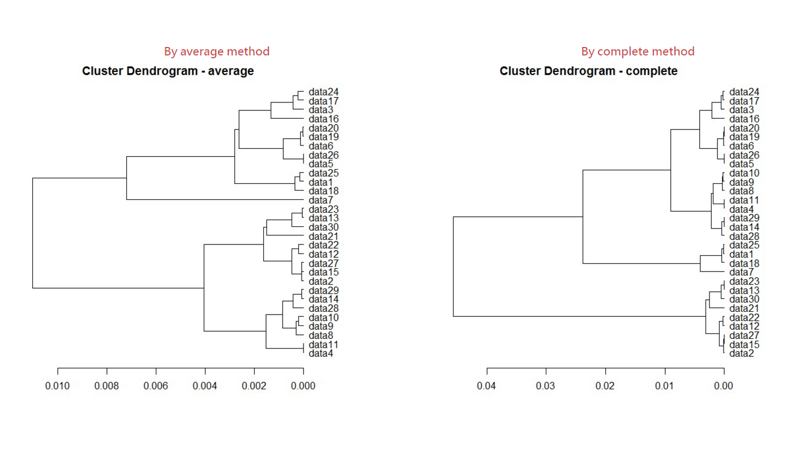

# Hierarchical clustering

<script src="../js/general.js"></script>

###Hierarchical clustering in R
---

```R
# generate the data
getOriData <- matrix( c(
	dim1 = rnorm(30,mean=100,sd=5),
	dim2 = cos(rnorm(30,mean=200,sd=100)),
	dim3 = sin(rnorm(30,mean=500,sd=300)),
	dim4 = sample(c(-100:100,NA),size=30,replace=TRUE),
	dim5 = sample(c(500:1000,NA),size=30,replace=TRUE)
	),
	ncol = 5
)

# change name of matrix
colnames(getOriData) <- c("dim1","dim2","dim3","dim4","dim5")
rowNameList <- c()
for(i in 1:nrow(getOriData)) {
	rowNameList <- c(rowNameList,paste("data",toString(i),sep=""))
}
rownames(getOriData) <- rowNameList

# get rid of NAs
getOriData[is.na(getOriData)] <- 0

# cluster on correlation
clusTree <- as.dist(1 - cor(t(getOriData)))
hc_ave <- hclust(clusTree, "average")
hc_cmp <- hclust(clusTree, "complete")

# draw the dendrogram
par(mar=c(3,1,1,3)) 
plot(
     as.dendrogram(hc_ave), labels = NULL, 
     axes = TRUE, frame.plot = FALSE, ann = TRUE,
     main = "Cluster Dendrogram - average",
     sub = NULL, cex = .6, horiz=T
)
par(mar=c(3,1,1,3)) 
plot(
     as.dendrogram(hc_cmp), labels = NULL, 
     axes = TRUE, frame.plot = FALSE, ann = TRUE,
     main = "Cluster Dendrogram - complete",
     sub = NULL, cex = .6, horiz=T
)

# get sub-tree
# by how much groups generated
getSubtreeGroup <- cutree( hc_ave, k=15 )

# by tree height
getSubtreeHeight <- cutree( hc_ave, h=0.007 )
```

###Example result
---

* The following is the result of hierarchical clustering to group as tree-typed format from auto-generated data.




