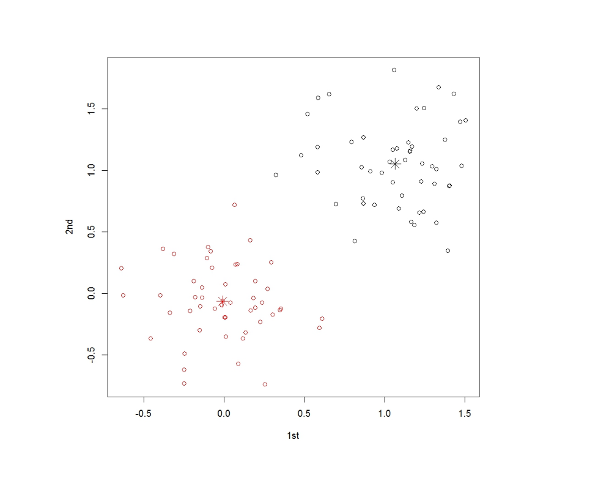

# K means

<script type="text/javascript" src="../js/general.js"></script>

###K means in R
---

```R
# intall packages and load the package
#install.packages("stats")
library("stats")

# the package for plotting the figure
require(graphics)

# generate the data
firstData <- matrix(rnorm(100, sd = 0.3), ncol = 2)
secondData <- matrix(rnorm(100, mean = 1, sd = 0.3), ncol = 2)
combineData <- rbind(firstData,secondData)
colnames(combineData) <- c("1st", "2nd")

# k-means function
# the centers must be assigned
clusterRes <- kmeans(combineData, centers=2)

# show the results
clusterRes <- clusterRes$cluster

# plot
plot(combineData, col = clusterRes$cluster)
points(clusterRes$centers, col = 1:2, pch = 8, cex = 2)
```

###Example result
---

* The following is the result of kmeans to group two clusters from auto-generated data.


