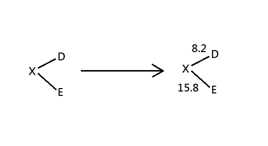
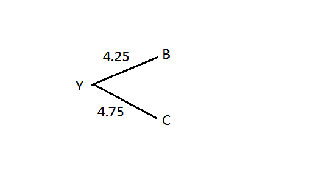
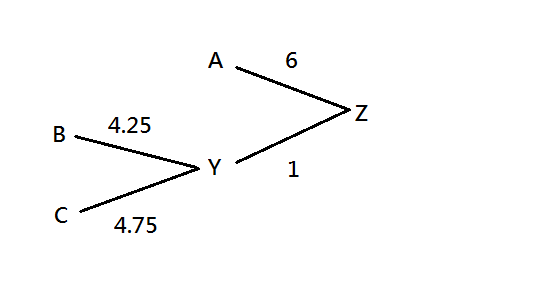
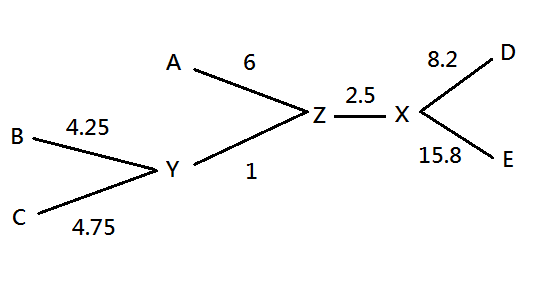

# Neighbor Joining (phylogeny tree)

<script src="../js/general.js"></script>

* Saitou et al. (1987) The neighbor-joining method: a new method for reconstructing phylogenetic trees. Mol Biol Evol 4(4), 406-425

###Several tree construction methods
---

| distance-based | character-based |
| -- | -- |
| similar with character-based | more reliable, more biological |
| fast, simple | slower, complex |
| the number of nucleotide/ amino acid differences | Interpret molecular changes in the context (shared derived characters) |
| much popular | - |

* Neighbor-joining 
  1. a **clustering** method
  2. **distance**-based method
  3. the principle is **minimal evolution** : **the building tree preferred with the smallest branch length in each step**

###Example : Molecular phylogeny 
---

* a science: DNA, RNA & protein sequences used to deduce(trace) relationships 

* relationships are like :


* distance matrix example

```text
# molecular sequence example
> seqA 
ATCGATCG 
> seqB 
ATCCATCG 
> seqC 
ATCATTCC 
```

|  | seqA | seqB | seqC |
| -- | -- | -- | -- |
| seqA | 0 | 1 | 3 |
| seqB | 1 | 0 | 3 |
| seqC | 3 | 3 | 0 |


* Used example : initial distance matrix 

```text
# sequence alignment 
A: gorilla 
B: chimpanzee 
C: human 
D: orangutan 
E: macaque 
```

|  | B | C | D | E |
| -- | -- | -- | -- | -- |
| A | 11 | 12 | 17 | 24 |
| B |  | 9 | 16 | 24 |
| C |  |   | 16 | 24 |
| D |  |   |    | 24 |

###STEP 1 (N = 5 nodes remained)
---

* calculate $$S_x value = \sum^{N}_{i=1}{d_{xi}}$$，N = operation taxonomic units
  1. $$S_A = S_{AB} + S_{AC} + S_{AD} + S_{AE} = 11 + 12 + 17 + 24 = 64$$
  2. $$S_B = S_{BA} + S_{BC} + S_{BD} + S_{BE} = 11 + 9 + 16 + 24 = 60$$
  3. $$S_C = 61$$
  4. $$S_D = 73$$
  5. $$S_E = 96$$

* calculate $$\beta_{ij} = d_{ij}-\frac{S_i + S_j}{N-2}$$
  1. $$\beta_{AB} = 11 - \frac{64 + 60}{5 - 2} = -30.3$$
  2. $$\beta_{AC} = 12 - \frac{64+61}{5-2} = -29.7$$
  3. $$\beta_{AD} = 17 - \frac{64 + 73}{5-2} = -28.7$$
  4. calculate all $$\beta_{ij}$$ ($$\beta_{ij}$$ joined as neighbors)

* New matrix: **related total branch length**

|  | B | C | D | E |
| -- | -- | -- | -- | -- |
| A | -30.3 | -29.7 | -28.7 | -29.3 |
| B |  | -29.7 | -28.3 | -28 |
| C |  |   | -28.7 | -28.3 |
| D |  |   |    | ** -32.3 ** |

* Construct a tree : the ** smallest ** total branch length: added to the previous tree built



* new node (X): combine node D and node E 
  1. $$d_{DX}=[d_{DE} + \frac{S_D-S_E}{N-2}] / 2 = [24 + \frac{73-96}{3}] / 2 = 8.2$$
  2. $$d_{EX} = d_{DE}-d_{DX} = 24-8.2 = 15.8$$


###STEP 2 (N = 4 nodes remained)
---

* calculate new $$d_{ij}$$ value
  1. $$d_{XA} = (d_{DA} + d_{EA} - d_{DE}) / 2 = (17 + 24 - 24) / 2 = 8.5$$
  2. $$d_{XB} = (d_{DB} + d_{EB} - d_{DE}) / 2 = (16 + 24 -24)/2 = 8$$
  3. $$d_{XC} = (d_{DC} + d_{EC} - d_{DE}) / 2 = 8$$

* new distance matrix: x represents both node D and node E

|  | B | C | X |
| -- | -- | -- | -- |
| A | 11 | 12 | 8.5 |
| B |  | 9 | 8 |
| C |  |   | 8 |

* calculate $$S_x value = \sum^{N}_{i=1}{d_{xi}}$$，N = operation taxonomic units
  1. $$S_A = S_{AB} + S_{AC} + S_{AX} = 11 + 12 + 8.5 = 31.5$$
  2. $$S_B = S_{BA} + S_{BC} + S_{BX} = 11 + 9 + 8 = 28$$
  3. $$S_C = S_{CA} + S_{CB} + S_{CX} = 12 + 9 + 8 = 29$$
  4. $$S_X = S_{XA} + S_{XB} + S_{XC} = 8.5 + 8 + 8 = 24.5$$

* calculate $$\beta_{ij} = d_{ij}-\frac{S_i + S_j}{N-2}$$
  1. $$\beta_{AB} = 11-(31.5+28)/2 = -18.75$$
  2. $$\beta_{AC} = 12 - (31.5+29)/2 = -18.25$$
  3. calculate all $$\beta_{ij}$$

* New matrix: **related total branch length**

|  | B | C | X |
| -- | -- | -- | -- |
| A | -18.75 | -18.25 | -19.5 |
| B |  | **-19.5** | -18.25 |
| C |  |   | -18.75 |

* Construct a tree : the ** smallest ** total branch length: added to the previous tree built



* new node (Y): combine node B and node C 
  1. $$d_{BY} = [d_{BC} + \frac{S_B - S_C}{N-2}]/2 = [9 + \frac{28-29}{2}]/2=4.25$$
  2. $$d_{CY} = d_{BC} - d_{BY} = 9 - 4.25 =4.75$$

###STEP 3 (N = 3 nodes remained) 
---

* new distance matrix
  1. X represents both node D and node E 
  2. Y represents both node B and node C
  3. $$d_{YA} = (d_{BA} + d_{CA} - d_{BC}) / 2 = (11 + 12 - 9) / 2 = 7$$
  4. $$d_{YX} = (d_{BX} + d_{CX} -d_{BC})/2 = (8 + 8 - 9)/2=3.5$$

* new distance matrix: Y represents both node B and node C

|  | Y | X |
| -- | -- | -- |
| A | 7 | 8.5 |
| Y |  | 3.5 |

* calculate $$S_x value = \sum^{N}_{i=1}{d_{xi}}$$，N = operation taxonomic units
  1. $$S_A = S_{AX} + S_{AY} = 8.5 + 7 = 15.5$$
  2. $$S_X = S_{XA} + S_{XY} = 8.5 + 3.5 = 12$$
  3. $$S_Y = S_{YA} + S_{YX} = 7 + 3.5 = 10.5$$

* calculate $$\beta_{ij} = d_{ij}-\frac{S_i + S_j}{N-2}$$
  1. $$\beta_{AY} = 7 – (15.5 + 10.5)/1 = -19 $$
  2. $$\beta_{AX} = 8.5 – (15.5 + 12)/1 = -19 $$
  3. $$\beta_{XY} = 3.5 – (12 + 10.5)/1 = -19$$

* New matrix: **related total branch length**

|  | Y | X |
| -- | -- | -- |
| A | **-19** | -19 |
| Y |  | -19 |

* new node (Z): combine node A and node Y 
  1. $$d_{AZ} = [d_{AY} + \frac{S_A - S_Y}{N-2}]/2 = [7 + \frac{15.5-10.5}{1}]/2 = 6$$
  2. $$d_{YZ} = d_{AY} - d_{AZ} = 7 -6 = 1$$

* Construct a tree : the ** smallest ** total branch length: added to the previous tree built



###STEP 4 (N = 2 nodes remained)
---

* new distance matrix: 
  1. X represents both node D and node E
  2. Y represents both node B and node C
  3. Z represents both node A and node Y
  4. $$d_{XZ} = (d_{AX} + d_{YX} - d_{AY})/2 = (8.5+3.5-7)/2=2.5$$

* new distance matrix : Z represents both node A and node Y

|  | X |
| -- | -- |
| Z | 2.5 |

* calculate $$S_x value = \sum^{N}_{i=1}{d_{xi}}$$，N = operation taxonomic units
  1. $$S_X = S_{XZ} = 2.5 = S_{XZ} = S_Z$$

* Construct a tree : the ** smallest ** total branch length: added to the previous tree built




