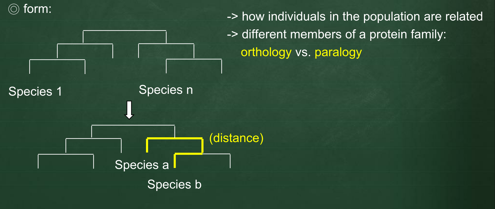

# Neighbor Joining (phylogeny tree)
---

<script src="../js/general.js"></script>

* Saitou et al. (1987) The neighbor-joining method: a new method for reconstructing phylogenetic trees. Mol Biol Evol 4(4), 406-425

###Several tree construction methods
---

| distance-based | character-based |
| -- | -- |
| similar with character-based | more reliable, more biological |
| fast, simple | slower, complex |
| the number of nucleotide/ amino acid differences | Interpret molecular changes in the context (shared derived characters) |
| much popular | - |

* Neighbor-joining 
  1. a method is one of distance-based methods.
  2. the principle is **minimal evolution** : **the building tree preferred with the smallest branch length in each step**

###Example : Molecular phylogeny 
---

* a science: DNA, RNA & protein sequences used to deduce(trace) relationships 

* relationships are like :



* distance matrix example

```text
# molecular sequence example
> seqA 
ATCGATCG 
> seqB 
ATCCATCG 
> seqC 
ATCATTCC 
```

|  | seqA | seqB | seqC |
| -- | -- | -- | -- |
| seqA | 0 | 1 | 3 |
| seqB | 1 | 0 | 3 |
| seqC | 3 | 3 | 0 |


* Used example : initial condition 

```text
A: gorilla 
B: chimpanzee 
C: human 
D: orangutan 
E: macaque 
(alignment) 
```

|  | B | C | D | E |
| -- | -- | -- | -- | -- |
| A | 11 | 12 | 17 | 24 |
| B |  | 9 | 16 | 24 |
| C |  |   | 16 | 24 |
| D |  |   |    | 24 |


