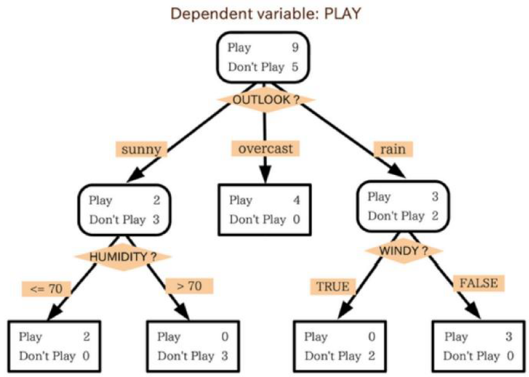

# Random Forest

<script type="text/javascript" src="../js/general.js"></script>

* 範例檔案 : 20160614_random_forest.rar

###Discussion and flows
---

Random Forest is a **divide-and-conquer** method useful for data classification and 
regression. Random Forest is an **ensemble learning** method - generate several classifiers and 
aggregate their results into one at final - built on **decision trees** (figure.1 [1]). In the other 
words, a model generated by random forest combines several **weaker learners** (classifiers) into 
a **stronger learner** at final. The following figure.2 [1] is an example of the above statements. 



[Figure.1] A simple example demonstrates decision trees. There is a variable with conditions to classify two dimension data, people who want to play and not to play ball games. 


[Figure.2] The basic concept implements random forest method. The blue point represents each observed data. Each gray curve, a weaker learner, is an approximation to one subset of total data. The red curve, a stronger learner, is much better and outstanding than the other gray curve. 

Basically about **66% (2/3)** of total data in random would be taken as a training dataset 
building decision trees and the other **34% (1/3)** of total data would be regard as a testing 
dataset. There are two methods specific to implement combining classification trees, **boosting 
and bagging**. In boosting tree (figure.3 [2]), successive trees would modify and give an extra 
weighted score to points which were incorrectly predicted by previous trees. After each data is 
taken at least once and the predicting result is converged, the action of random selecting and 
construction of decision trees would be stopped. In the end, a vote with weighted would be 
used for prediction. In bagging tree (figure.4 [2]), successive trees would be operated 
independently from the previous trees. That is, each time decision tree construction would use 
a bootstrap sample of the dataset. After each data is selected once, a majority vote is used for 
prediction. 


[Figure.3] Boosting of tree construction. Successive trees would get weighted to points which were incorrectly predicted. In the end prediction would be accomplished by taking a vote with weighted. 


[Figure.4] Bagging of tree construction. Successive trees would operate independently from the previous tree. In the end prediction would be accomplished by a simple majority vote. 

There are many methods using random forest concept as their core. In data mining and 
machine learning, random forest method would be used for classifying data and for regression 
of data.   

The random forest method is famous for operative speed, unbalanced data and missing 
data. But its weakness is hard to predict beyond the range in the training data and could be 
over-fitting when data with higher noise exists. 

###Example in R
---

* Use R to implement random forest prediction (classification) and regression

* data (train) : Use iris dataset

|  | Sepal.Length | Sepal.Width | Petal.Length | Petal.Width | Species |
| -- | -- | -- | -- | -- | -- |
| 1 | 5.1 | 3.5 | 1.4 | 0.2 | setosa |
| 2 | 4.9 | 3.0 | 1.4 | 0.2 | setosa |
| 3 | 4.7 | 3.2 | 1.3 | 0.2 | setosa |
| 4 | 4.6 | 3.1 | 1.5 | 0.2 | setosa |
| 5 | 5.0 | 3.6 | 1.4 | 0.2 | setosa |

* R code

```R
# necessary packages
install.packages("randomForest")
library("randomForest")

# get data for training and testing
# removed the Species column for further prediction
test  <- iris[ c(1:10, 51:60, 101:110), -5]  
reallySpec <- iris[ c(1:10, 51:60, 101:110), 5] 
train <- iris[ c(11:50, 61:100, 111:150), ]

# random forest training
r <- randomForest(Species ~., data=train, importance=TRUE, do.trace=50)

# random forest prediction
predSpec <- predict(r, test)

# conbime data
showData <- cbind(as.matrix(reallySpec),as.matrix(predSpec))
colnames(showData) <- c("real species", "predicted species")

# true or false
trueRes <- 0
falseRes <- 0
TrueOrFalse <- c()

for (i in 1:nrow(showData)) {
	if(showData[i,1] == showData[i,2]) {
		trueRes = trueRes + 1
		TrueOrFalse <- c(TrueOrFalse,"Yes")
	}
	else {
		falseRes = falseRes + 1
		TrueOrFalse <- c(TrueOrFalse,"No")
	}
}

# show classification results
showData <- cbind(showData, TrueOrFalse)
print(showData)

trueRatio <- trueRes / (trueRes + falseRes)
falseRes <- falseRes / (trueRes + falseRes)
print(paste(c("True Ratio",toString(trueRatio)),sep=": "))
print(paste(c("False Ratio",toString(falseRes)),sep=": "))

# ----------------------------------------------------------------------
# regression 
library("randomForest")

# prepare data
xPos <- seq(-3.0,3.0, by=0.006)
noise <- rnorm(1001)

yPos <- sin(xPos) + noise/6
mat <- matrix(c(xPos,yPos),ncol=2,dimnames=list(NULL,c("X_Pos","Y_Pos")))

# show the result
r <- randomForest(Y_Pos~.,data=mat, maxnodes=10)
plot(xPos,predict(r,mat),type="l",col="green",lwd=3)
points(xPos,yPos)
```

*  Progress building decision trees : OOB means “out-of-bag” – predict the data not in the bootstrap sample -, and 1, 2, 3 mean classes

```R
> r <- randomForest(Species ~., data=train, importance=TRUE, do.trace=50)
ntree      OOB      1      2      3
   50:   5.83%  0.00% 10.00%  7.50%
  100:   5.83%  0.00% 10.00%  7.50%
  150:   7.50%  0.00% 10.00% 12.50%
  200:   6.67%  0.00% 10.00% 10.00%
  250:   6.67%  0.00% 10.00% 10.00%
  300:   7.50%  0.00% 10.00% 12.50%
  350:   6.67%  0.00% 10.00% 10.00%
  400:   6.67%  0.00% 10.00% 10.00%
  450:   6.67%  0.00% 10.00% 10.00%
  500:   6.67%  0.00% 10.00% 10.00%
```

* the prediction result with real state, prediction state and compares

```R
    real species predicted species TrueOrFalse
1   "setosa"     "setosa"          "Yes"      
2   "setosa"     "setosa"          "Yes"      
3   "setosa"     "setosa"          "Yes"      
4   "setosa"     "setosa"          "Yes"      
5   "setosa"     "setosa"          "Yes"      
6   "setosa"     "setosa"          "Yes"      
7   "setosa"     "setosa"          "Yes"      
8   "setosa"     "setosa"          "Yes"      
9   "setosa"     "setosa"          "Yes"      
10  "setosa"     "setosa"          "Yes"      
51  "versicolor" "versicolor"      "Yes"      
52  "versicolor" "versicolor"      "Yes"      
53  "versicolor" "versicolor"      "Yes"      
54  "versicolor" "versicolor"      "Yes"      
55  "versicolor" "versicolor"      "Yes"      
56  "versicolor" "versicolor"      "Yes"      
57  "versicolor" "versicolor"      "Yes"      
58  "versicolor" "versicolor"      "Yes"      
59  "versicolor" "versicolor"      "Yes"      
60  "versicolor" "versicolor"      "Yes"      
101 "virginica"  "virginica"       "Yes"      
102 "virginica"  "virginica"       "Yes"      
103 "virginica"  "virginica"       "Yes"      
104 "virginica"  "virginica"       "Yes"      
105 "virginica"  "virginica"       "Yes"      
106 "virginica"  "virginica"       "Yes"      
107 "virginica"  "versicolor"      "No"       
108 "virginica"  "virginica"       "Yes"      
109 "virginica"  "virginica"       "Yes"      
110 "virginica"  "virginica"       "Yes
```

* the true ratio and false ratio of the prediction.

```R
> trueRatio <- trueRes / (trueRes + falseRes)
> falseRes <- falseRes / (trueRes + falseRes)
> print(paste(c("True Ratio",toString(trueRatio)),sep=": "))
[1] "True Ratio"        "0.966666666666667"
> print(paste(c("False Ratio",toString(falseRes)),sep=": "))
[1] "False Ratio"        "0.0333333333333333"
```

* Use R to implement random forest regression. The 6 shows the data distribution and its random forest regression. The black point represents origin data and the green line represents the regression result. The regression is good for describing the origin data.


```R
# first is to generate the similiar data with the study
# each strain contains six kinds of metabolite abundance
# 6: G6P, 6PL, 6PG, RL5, R5P, PRPP

abundance <- c(0,0,0,0,0,0)

# 1:21 represent strain 1 to strain 21
for(i in 1:21) {
	temp_abundance <- c()
	min = 0
	max = 0

	if(i %% 2 == 1) {
		min = 1
		max = 2
	}
	else {
		min = 0
		max = 1
	}

	# 1:6 represent six kinds of metabolite abundance
	for(j in 1:6) {
		if(j == 4 && i %% 2 == 1) {
			temp_abundance <- c(temp_abundance, runif(1, 1, 2))
		}
		else if(j == 5 && i %% 2 == 1) {
			temp_abundance <- c(temp_abundance, runif(1, 1.5, 5))
		}
		else if(j == 4 && i %% 2 == 0) {
			temp_abundance <- c(temp_abundance, runif(1, 1, 2))
		}
		else if(j == 5 && i %% 2 == 0) {
			temp_abundance <- c(temp_abundance, runif(1, 1, 3))
		}
		else {
			temp_abundance <- c(temp_abundance, runif(1, min, max))
		}
	}

	abundance <- rbind(abundance, temp_abundance)
}

abundance <- abundance[-1,]

# modify the row name for strain name and column for six kinds of metabolite
strainName <- c()
for(i in 1:21) {
	strainName <- c(strainName, paste("strain",toString(i),sep="."))
}
rownames(abundance) <- strainName

# modify the column name for six kinds of metabolites
metaboliteName <- c("G6P", "6PL", "6PG", "RL5", "R5P", "PRPP")
colnames(abundance) <- metaboliteName

# show all data
print(abundance)

# --------------------------------
# Preparing data had been finished
# --------------------------------

# start to calculate pentose phosphate pathway
# first is to calculate mean of G6P and 6PL
# second is data distribution
PPPmean <- abundance[,1:3]
PPPres <- apply(PPPmean,1,mean)
PPPresMean <- mean(PPPres)
PPPresSD <- sd(PPPres)

# relative standard deviation: cumulative distribution
PPPreltSD <- c()
for(i in 1:21) {
	PPPreltSD <- c(PPPreltSD, (PPPres[i]-PPPresMean)/PPPresSD)
}
# print(PPPreltSD)

PPPSdMin <- min(PPPreltSD)
PPPSdMax <- max(PPPreltSD)
# s.d > half
PPPUp <- PPPreltSD[which(PPPreltSD > (PPPSdMin + PPPSdMax)/2)]
# s.d < half
PPPDown <- PPPreltSD[which(PPPreltSD < (PPPSdMin + PPPSdMax)/2)]

# color parameters
library(lattice)
rgb.palette <- colorRampPalette(c("purple","green"), space = "rgb")
plotColor <- rgb.palette(21)

# order to map colors
colorOrder <- PPPreltSD[order(PPPreltSD)]
colorOrder <- as.matrix(colorOrder)

# prepare for levelplot
getLevel <- colorOrder 

# plot
xRange <- c(min(PPPres)-2,max(PPPres)+ 2)
yRange <- c(-3,25)
xLabel <- "activity"
yLabel <- "strain"
plot(0,type="n",ylim=yRange,xlim=xRange,xlab=xLabel,ylab=yLabel)

# find position of order
findOrder <- function(name) {
	for(i in 1:21) {
		if(name == rownames(colorOrder)[i]) {
			return(i)
		}
	}
}

# draw
# 00F00 positive max, A020F0 negative max
mid <- (min(PPPres) + max(PPPres))/2
drawToY <- 0
for(i in 1:length(PPPUp)) {
	temp <- rownames(as.matrix(PPPUp))[i]
	leng <- PPPres[temp]
	dx <- c(mid-0.2-leng, mid-0.2)
	dy <- c(22-i,22-i)
	color <- plotColor[findOrder(temp)]
	lines(dx,dy,col=color,lw=2)
	drawToY <- i
}

for(i in 1:length(PPPDown)) {
	temp <- rownames(as.matrix(PPPDown))[i]
	leng <- PPPres[temp]
	dx <- c(mid-0.2-leng, mid-0.2)
	dy <- c(22-drawToY-i,22-drawToY-i)
	color <- plotColor[findOrder(temp)]
	lines(dx,dy,col=color,lw=2)
}

# --------------------------------
# Drawing Pentose phosphate pathway had finished
# --------------------------------

# start to draw PRPP formation
PPPmean <- abundance[,6]
PPPres <- PPPmean
PPPresMean <- mean(PPPres)
PPPresSD <- sd(PPPres)

# relative standard deviation: cumulative distribution
PPPreltSD <- c()
for(i in 1:21) {
	PPPreltSD <- c(PPPreltSD, (PPPres[i]-PPPresMean)/PPPresSD)
}

PPPSdMin <- min(PPPreltSD)
PPPSdMax <- max(PPPreltSD)
# s.d > half
PPPUp <- PPPreltSD[which(PPPreltSD > (PPPSdMin + PPPSdMax)/2)]
# s.d < half
PPPDown <- PPPreltSD[which(PPPreltSD < (PPPSdMin + PPPSdMax)/2)]

# color parameters
library(lattice)
rgb.palette <- colorRampPalette(c("purple","green"), space = "rgb")
plotColor <- rgb.palette(21)

# order to map colors
colorOrder <- PPPreltSD[order(PPPreltSD)]
colorOrder <- as.matrix(colorOrder)

# draw
# 00F00 positive max, A020F0 negative max
mid <- (min(PPPres) + max(PPPres))/2
drawToY <- 0
for(i in 1:length(PPPUp)) {
	temp <- rownames(as.matrix(PPPUp))[i]
	leng <- PPPres[temp]
	dx <- c(mid + 0.2, mid + 0.2 + leng)
	dy <- c(22-i,22-i)
	color <- plotColor[findOrder(temp)]
	lines(dx,dy,col=color,lw=2)
	drawToY <- i
}

for(i in 1:length(PPPDown)) {
	temp <- rownames(as.matrix(PPPDown))[i]
	leng <- PPPres[temp]
	dx <- c(mid + 0.2, mid + 0.2 + leng)
	dy <- c(22-drawToY-i,22-drawToY-i)
	color <- plotColor[findOrder(temp)]
	lines(dx,dy,col=color,lw=2)
}

# --------------------------------
# Drawing PRPP formation had finished
# --------------------------------

# drawing RL5/R5P

calRatio <- function(value) {
	return(value[2]/value[1])
}

PPPmean <- abundance[,4:5]
# because the ratio hard to control true condition
# use mean to represent that both level are down
PPPres <- apply(PPPmean,1,mean)
PPPresMean <- mean(PPPres)
PPPresSD <- sd(PPPres)

# relative standard deviation: cumulative distribution
PPPreltSD <- c()
for(i in 1:21) {
	PPPreltSD <- c(PPPreltSD, (PPPres[i]-PPPresMean)/PPPresSD)
}

PPPSdMin <- min(PPPreltSD)
PPPSdMax <- max(PPPreltSD)
# s.d > half
PPPUp <- PPPreltSD[which(PPPreltSD > (PPPSdMin + PPPSdMax)/2)]
# s.d < half
PPPDown <- PPPreltSD[which(PPPreltSD < (PPPSdMin + PPPSdMax)/2)]

# color parameters
library(lattice)
rgb.palette <- colorRampPalette(c("purple","green"), space = "rgb")
plotColor <- rgb.palette(21)

# order to map colors
colorOrder <- PPPreltSD[order(PPPreltSD)]
colorOrder <- as.matrix(colorOrder)

# draw circle: must install packages
install.packages("plotrix")
library("plotrix")

# 00F00 positive max, A020F0 negative max
mid <- min(PPPres) / max(PPPres)
drawToY <- 0
for(i in 1:length(PPPUp)) {
	temp <- rownames(as.matrix(PPPUp))[i]
	leng <- PPPres[temp]
	dx <- 1
	dy <- c(22-i,22-i)
	color <- plotColor[findOrder(temp)]
	draw.circle(dx,dy,leng/20,nv=100,border=NULL,col=color,lty=1,lwd=1)
	drawToY <- i
}

for(i in 1:length(PPPDown)) {
	temp <- rownames(as.matrix(PPPDown))[i]
	leng <- PPPres[temp]
	dx <- 1
	dy <- c(22-drawToY-i,22-drawToY-i)
	color <- plotColor[findOrder(temp)]
	draw.circle(dx,dy,leng/20,nv=100,border=NULL,col=color,lty=1,lwd=1)
}

# draw text
legend(-1.2, 23,"Pentose Phosphate pathway", col = "black", cex=.6)
legend(0.5, 25,"R5P/PL5 ratio", col = "black", cex=.6)
legend(1.2, 23,"Nucl. Biosyn. Pathway", col = "black", cex=.6)

legend(-2, 12,"Glucose-6-P", col = "black", cex=.6)
legend(3, 12,"PRPP", col = "black", cex=.6)

# draw standard
draw.circle(-1,0,max(PPPres)/20,nv=100,border=NULL,col="#00FF00",lty=1,lwd=1)
legend(-1.5, -1,paste("relative abundance",toString(max(PPPres)),sep=":"), col = "black", cex=.6)

#levelplot(getLevel, main="S.D.", xlab="", ylab="", col.regions=rgb.palette(120), cuts=120, at=seq(ceil(min(getLevel)),floor(max(getLevel)),0.05), scales=list(x=list(rot=90)))
```
