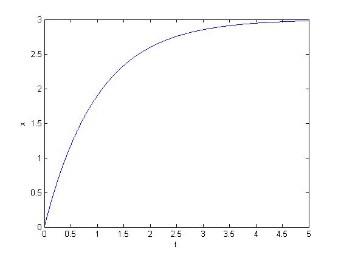

# First Order ODE

<script type="text/javascript" src="../js/general.js"></script>

### Solve in Matlab
---

* solve 1st order differential equation : $$\frac{dx}{dt} = 3e^{-t}$$, and initial x(0) = 0

```matlab
function test1
    % solv dx/dt = 3 exp (-t)
    % init x(0) = 0
    
    t = 0:0.001:5;
    init_x = 0;
    
    [t, x] = ode45(@rhs, t, init_x);
    plot(t,x);
    xlabel('t');
    ylabel('x');
    
    function dxdt = rhs(t, x)
        dxdt = 3 * exp (-t);
    end
end
```

* the result


