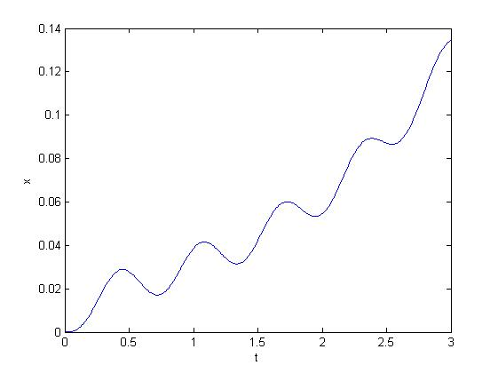
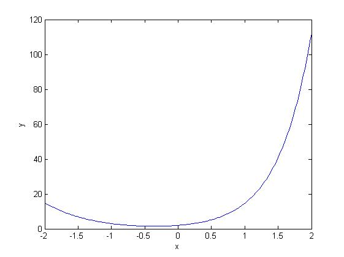
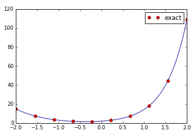

# Second Order ODE


## Example.1 
* solve 2nd order differential equation :　$$\frac{d^{2}x}{dt^{2}} +５\frac{dx}{dt}-4x(t) = sin(10t)$$, and initial x(0) = 0 and x'(0) = 0

* Derivation

assume $$x_{1} = x, x_{2} = x'$$

$$=> x_{1}' = x', x_{2}' = x''$$

$$=> x_{2} = x_{1}'$$ and $$x_{2}' + 5x_{1}' -4x = sin(10t)$$

$$=> x_{1}' = x_{2}$$ and $$x_{2}' = -5x_{1}' + 4x + sin(10t) = -5x_{2} + 4x_{1} + sin(10t) $$

then the above 2 first order ODE would be further solved on matlab code

* matlab code

```matlab
function second_order_ode
    % solv : d2x/dt2 + 5 dx/dt - 4 x = sin (10t)
    % init : x(0) = 0, x'(0) = 0
    
    t = 0:0.01:3
    init_x = 0;
    init_dxdt = 0;
    
    [t, x] = ode45(@rhs, t, [init_x init_dxdt]);
    plot(t, x(:,1));
    xlabel('t');
    ylabel('x');
    
    % two first order ode implemented
    function dxdt = rhs(t, x)
        dxdt_1 = x(2);
        dxdt_2 = -5*x(2) + 4*x(1) + sin(10*t);
        
        dxdt = [dxdt_1; dxdt_2];
    end
end
```

* the result




## Example.2 
* solve 2nd order differential equation : $$(3x-1)\frac{d^{2}y}{dx^{2}}-(3x+2)\frac{dy}{dx}-(6x-8)y = 0$$, and initial y(0) = 2, y'(0) = 3

* Derivation

assume $$y_{1} = y$$, $$y_{2} = y'$$

=> $$y_{1}' = y'​$$, $$y_{2}' = y''​$$

=> $$y_{1}' = y_{2}$$, and $$(3x-1)y_{2}' - (3x+2)y_{1}' - (6x - 8)y = 0$$

then $$y_{1}' = y_{2}$$, and $$y_{2}' = \frac{(3x + 2)y_{2} + (6x - 8)y_{1}}{(3x - 1)}$$

* matlab code

```matlab
function example
    
    init_y = 2;
    init_dydx = 3;
    
    % integrate from 0 to 2
    x = 0 : 0.02 : 2;
    [x, y] = ode45(@rhs, x, [init_y init_dydx]);
    plot(x, y(:,1));
    
    % try to plot two line
    hold on
    
    % integrate from -2 to 0
    x = 0 : -0.02 : -2;
    [x, y] = ode45(@rhs, x, [init_y init_dydx]);
    plot(x, y(:,1));
    
    hold off
    
    xlabel('x');
    ylabel('y');

    function dydt = rhs(x, y)
        dydt_1 = y(2);
        dydt_2 = ((3*x + 2) * y(2) + (6*x - 8) * y(1))/(3*x-1);
        dydt = [dydt_1; dydt_2];
    end
end
```

the result in matlab



* python code

```python
import numpy as np
import scipy as sp
from scipy.integrate import odeint
import matplotlib.pyplot as plt

def g(y, x):
    y0 = y[0]
    y1 = y[1]
    y2 = ((3*x+2)*y1 + (6*x-8)*y0)/(3*x-1)
    return y1, y2

# Initial conditions on y, y' (x=0)
init = 2.0, 3.0

# integrate from 0 to 2
x = np.linspace(0,2,100)
sol = odeint(g, init, x)
plt.plot(x, sol[:,0], color='b')

# integrate from 0 to -2
x = np.linspace(0,-2,100)
sol = odeint(g, init, x)
plt.plot(x, sol[:,0], color='b')

# The analytical answer in red dots
exact_x = np.linspace(-2,2,10)
exact_y = 2*np.exp(2*exact_x)-exact_x*np.exp(-exact_x)
plt.plot(exact_x,exact_y, 'o', color='r', label='exact')
plt.legend()

plt.show()
```

the result in python


