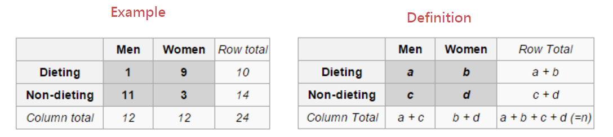

# Fisher's exact test

<script src="../js/general.js"></script>

###Definition
---



$$p=\frac{\binom{a+b}{a}\binom{c+d}{c}}{\binom{n}{a+c}}=\frac{(a+b)!(c+d)!(a+c)!(b+d)!}{(a!)(b!)(c!)(d!)(n!)}$$

###R script
---

* package: fisher.test {stats}

* original function prototype

```R
fisher.test(
  x, 
  y = NULL, 
  workspace = 200000, 
  hybrid = FALSE, 
  control = list(), 
  or = 1, 
  alternative = c("two.sided","greater","less"), 
  conf.int = TRUE, 
  conf.level = 0.95, 
  simulate.p.value = FALSE, 
  B = 2000
)
```

