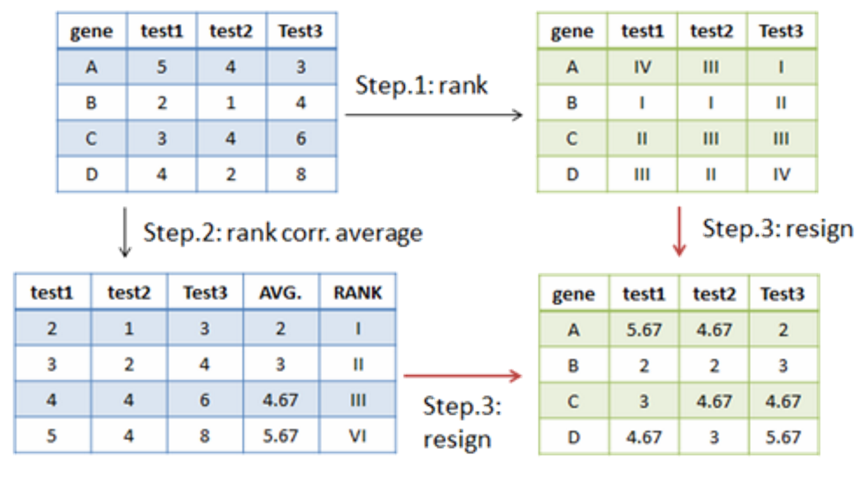

# Quantile Normalization

<script type="text/javascript" src="../js/general.js"></script>

###Background
---

* The simple plot shows flowchart of quantile normalization.



###Quantile normalization in R
---

* Package: preprocessCore (in bioconductor) 

```R
# reference
#http://svitsrv25.epfl.ch/R-doc/library/preprocessCore/html/normalize.quantiles.html

# install package
source('http://bioconductor.org/biocLite.R')
biocLite('preprocessCore')

# load package
library(preprocessCore)

# assign the data prepared for quantile normalization
# notice r is the column vector
qMat <- matrix(c(5,2,3,4,4,1,4,2,3,4,6,8),ncol=3)
# current qMat
#     [,1] [,2] [,3]
#[1,]    5    4    3
#[2,]    2    1    4
#[3,]    3    4    6
#[4,]    4    2    8

# start to calculation
res <- normalize.quantiles(qMat)
# the result of quantile normalization
#         [,1]     [,2]     [,3]
#[1,] 5.666667 5.166667 2.000000
#[2,] 2.000000 2.000000 3.000000
#[3,] 3.000000 5.166667 4.666667
#[4,] 4.666667 3.000000 5.666667
```


